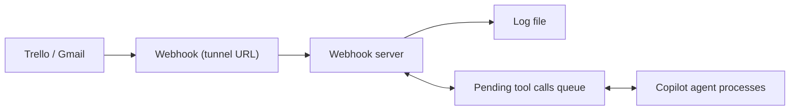

# Push Notifications Architecture

The webhook server ([`mcp/webhook-server/`](../mcp/webhook-server/index.js#L1)) listens for push notifications from Trello and Gmail and relays them to the Copilot agent.

## Flow

**Source:** [webhook server](../mcp/webhook-server/index.js#L179) · [event queue](../mcp/webhook-server/lib/event-queue.js#L1) · [trello handler](../mcp/webhook-server/handlers/trello.js#L99) · [gmail handler](../mcp/webhook-server/handlers/gmail.js#L1)

## Gmail Push

- Uses Gmail API push notifications via Pub/Sub or direct watch
- Setup: [`node mcp/webhook-server/scripts/setup-gmail-watch.js`](../mcp/webhook-server/scripts/setup-gmail-watch.js#L1)
- Requires OAuth2 credentials

## Trello Push

- Uses Trello webhooks
- Setup: [`node mcp/webhook-server/scripts/setup-trello-webhook.js`](../mcp/webhook-server/scripts/setup-trello-webhook.js#L1)
- Requires Trello API key and token

## Logging

- All notifications are logged to `logs/notifications/<source>/YYYY-MM-DD.jsonl`
- Webhook events logged to `logs/webhook/YYYY-MM-DD.log`
- Tool calls logged to `logs/tool_call/YYYY-MM-DD.log`
